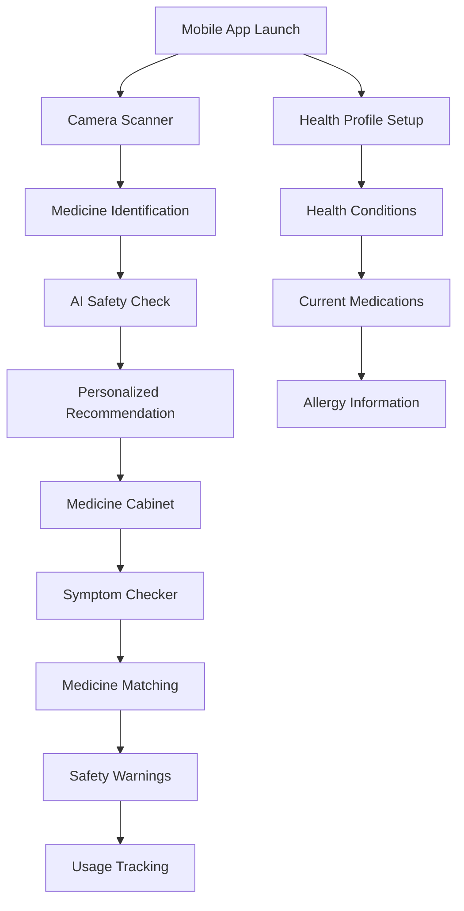

# RAG Medical Chatbot MVP - Product Requirements Document

## 1. Product Overview
A mobile-first RAG-based medical assistant that combines photo-based medicine identification with personalized health profiles to provide safe, accurate medication guidance. The system uses advanced computer vision to identify medicines from photos and cross-references user health data to provide personalized safety warnings and recommendations.

The product solves the critical problem of medication safety at home - helping users identify medicines, check safety based on their personal health conditions (pregnancy, allergies, existing medications), and get instant answers about symptom relief. This mobile-first approach targets everyday users who need immediate, safe access to medication information in their daily lives.

Target market value: Revolutionary personal medication safety platform that could prevent medication errors and improve health outcomes for millions of European users, with particular focus on vulnerable populations like pregnant women and elderly patients.

## 2. Core Features

### 2.1 User Roles
| Role | Registration Method | Core Permissions |
|------|---------------------|------------------|
| Guest User | No registration required | Can scan medicines, get basic information, limited safety warnings |
| Registered User | Email + health profile setup | Full access to personalized features, safety warnings, medicine cabinet, health profile management |
| Premium User | Subscription upgrade | Advanced features like prescription OCR, detailed drug interactions, family profiles |

### 2.2 Feature Module
Our mobile-first medical assistant consists of the following main features:
1. **Photo Medicine Scanner**: Camera interface for medicine identification, pill recognition, bottle scanning, prescription OCR.
2. **AI Health Assistant**: Conversational interface for symptom queries, medicine recommendations, safety checks.
3. **Personal Health Profile**: Health conditions setup, medication list, allergies, pregnancy status, medical history.
4. **Medicine Cabinet**: Digital inventory of home medicines, expiration tracking, usage reminders.
5. **Safety Center**: Drug interaction checker, contraindication alerts, dosage calculator, emergency information.
6. **Symptom Checker**: Match symptoms with available medicines, suggest alternatives, recommend medical consultation.

### 2.3 Feature Details
| Feature | Module | Description |
|---------|--------|-------------|
| Photo Medicine Scanner | Camera Interface | Take photos of medicine boxes, pills, or bottles for instant identification using computer vision |
| Photo Medicine Scanner | Prescription OCR | Scan doctor prescriptions to digitize and interpret medication instructions |
| Photo Medicine Scanner | Barcode Scanner | Scan medicine barcodes for instant identification and information |
| AI Health Assistant | Symptom Query | Ask if a specific medicine can help with your pain/symptoms with natural language |
| AI Health Assistant | Safety Check | Ask about medicine safety based on your health profile (pregnancy, allergies, etc.) |
| AI Health Assistant | Voice Interface | Hands-free voice input for queries while handling medicines |
| Personal Health Profile | Health Conditions | Record pregnancy status, chronic conditions, allergies that affect medication safety |
| Personal Health Profile | Current Medications | Track all medicines currently being taken to check for interactions |
| Personal Health Profile | Medical History | Store relevant medical history for more accurate recommendations |
| Medicine Cabinet | Inventory Management | Add, remove, and track medicines you have at home |
| Medicine Cabinet | Expiration Alerts | Get notified when medicines are about to expire |
| Medicine Cabinet | Usage Tracking | Track when and how often you take each medicine |
| Safety Center | Drug Interaction | Check if multiple medicines can be taken together safely |
| Safety Center | Contraindication Alerts | Receive warnings when a medicine conflicts with your health profile |
| Safety Center | Emergency Info | Quick access to critical medicine information in emergencies |
| Symptom Checker | Symptom Matching | Match your symptoms with appropriate medicines from your cabinet |
| Symptom Checker | Alternative Suggestions | Get suggestions for alternative medicines when needed |

## 3. Core Process
**Mobile Photo-Based Medicine Identification Flow:**
1. User opens mobile app and points camera at medicine
2. AI instantly identifies medicine from photo (pill, bottle, or box)
3. User asks "Can this help with my headache?" or "Is this safe for me?"
4. System checks user's health profile (pregnancy, allergies, current medications)
5. AI provides personalized safety warning and recommendation
6. User can add medicine to their digital cabinet or ask follow-up questions

**Symptom-to-Medicine Matching Flow:**
1. User describes symptoms: "I have a headache and I'm pregnant"
2. System analyzes user's medicine cabinet and health profile
3. AI recommends safe medicines from user's collection
4. System provides dosage guidance and safety warnings
5. User can take photo of recommended medicine for confirmation
6. System tracks usage and provides reminders if needed

**Emergency Safety Check Flow:**
1. User quickly scans medicine they're about to take
2. System immediately checks against health profile
3. Critical safety alerts appear instantly (pregnancy warnings, drug interactions)
4. Emergency contact information displayed if needed
5. Alternative medicine suggestions provided

## 4. User Interface Design
### 4.1 Design Style
- **Primary Colors**: Medical blue (#2563EB) and clean white (#FFFFFF)
- **Secondary Colors**: Success green (#10B981) for safe medicines, warning orange (#F59E0B) for cautions, danger red (#EF4444) for contraindications
- **Button Style**: Large, rounded buttons (min 56px height) optimized for touch, with haptic feedback
- **Font**: System fonts with large, readable sizes (18px+ for mobile), high contrast ratios
- **Layout Style**: Mobile-first card design with thumb-friendly navigation, bottom tab bar
- **Icons**: Large, clear medical icons with consistent design, camera and health-focused symbols

### 4.2 Mobile Interface Design

| Feature | Module Name | UI Elements |
|---------|-------------|-------------|
| Camera Scanner | Photo Capture | Full-screen camera view, circular capture button, flash toggle, gallery access |
| Camera Scanner | Medicine Recognition | Real-time overlay with medicine detection box, confidence indicator, instant results |
| Health Profile | Setup Wizard | Step-by-step forms with large inputs, progress indicator, skip options |
| Health Profile | Condition Cards | Toggle switches for conditions, pregnancy status prominently displayed, allergy badges |
| Medicine Cabinet | Inventory Grid | Large medicine cards with photos, expiration date badges, quick action buttons |
| Medicine Cabinet | Add Medicine | Camera button, barcode scanner, manual entry option, voice input |
| AI Assistant | Chat Interface | Large message bubbles, voice input button, quick response chips, safety alerts |
| AI Assistant | Safety Warnings | Full-screen alerts with clear icons, emergency contact buttons, alternative suggestions |
| Symptom Checker | Input Methods | Voice recording button, text input with autocomplete, body diagram for selection |
| Symptom Checker | Results Display | Swipeable medicine cards, safety scores, dosage information, interaction warnings |

### 4.3 Desktop Enhancements

| Feature | Module Name | UI Elements |
|---------|-------------|-------------|
| Dashboard | Overview Panel | Multi-column layout, detailed analytics charts, bulk medicine management |
| Medicine Database | Advanced Search | Filter sidebar, comparison tables, detailed medicine profiles |
| Health Profile | Comprehensive View | Tabbed interface, medical history timeline, document upload area |
| Reports | Analytics Dashboard | Usage statistics, safety alerts history, medicine effectiveness tracking |

### 4.4 Mobile-First Responsiveness
- **Mobile Portrait (320px-768px)**: Single column layout, bottom navigation, full-screen modals
- **Mobile Landscape (768px-1024px)**: Optimized for one-handed use, side navigation drawer
- **Tablet (1024px+)**: Two-column layout, enhanced touch targets, split-screen capabilities
- **Desktop (1200px+)**: Multi-column dashboard, detailed information panels, keyboard shortcuts

**Touch Optimization**: Minimum 56px touch targets, swipe gestures, pull-to-refresh, haptic feedback for critical actions