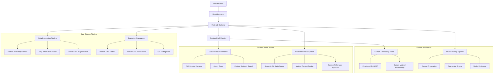
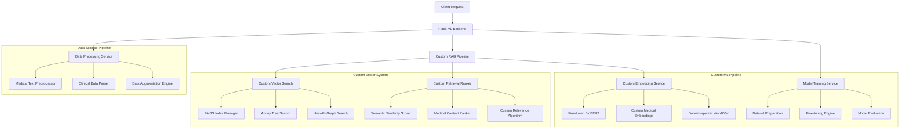
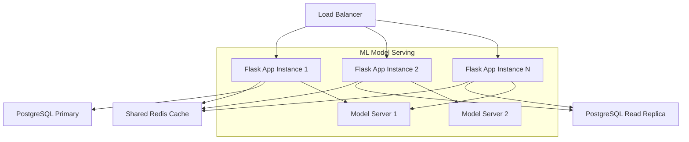
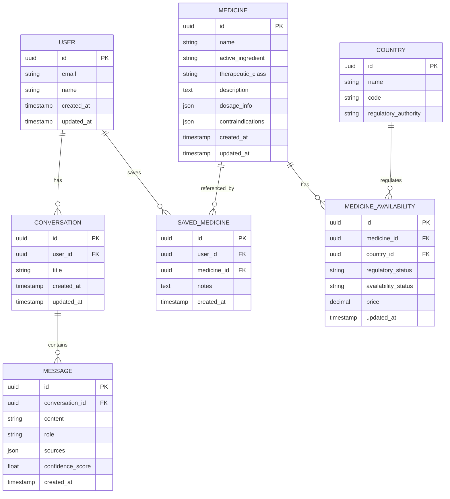

# RAG Medical Chatbot MVP - Custom ML & Data Science Architecture

## 1. Custom RAG Architecture Design



## 2. Custom ML Technology Stack

### 2.1 Core ML Technologies

* **Frontend**: React@18 + TypeScript + TailwindCSS + Chart.js (for ML metrics visualization)

* **Backend**: Flask@3.0 + PyTorch@2.0 + Transformers@4.35 + scikit-learn@1.3

* **Custom RAG Framework**: Built from scratch using PyTorch + NumPy + SciPy

### 2.2 Custom Embedding & Vector Technologies

* **Custom Embedding Models**:
  * Fine-tuned BioBERT (medical domain adaptation)
  * Custom Sentence-BERT (medical similarity tasks)
  * Domain-specific Word2Vec (medical terminology)

* **Custom Vector Database**:
  * FAISS (Facebook AI Similarity Search) - custom implementation
  * Annoy (Approximate Nearest Neighbors) - custom trees
  * Hnswlib (Hierarchical NSW) - custom graph construction

* **Vector Operations**: Custom NumPy/SciPy implementations for similarity search

* **Primary Database**: PostgreSQL + SQLAlchemy ORM (metadata only)

### 2.3 Custom ML & Data Science Stack

* **Model Training**: PyTorch + Transformers + Custom loss functions

* **Data Processing**: Pandas + NumPy + NLTK + spaCy + Custom medical NLP

* **Evaluation**: Custom metrics + scikit-learn + Matplotlib + Seaborn

* **Experimentation**: MLflow + Weights & Biases + Custom experiment tracking

### 2.4 Medical Dataset Processing

* **Text Processing**: Custom medical text tokenization and normalization

* **Data Augmentation**: Synonym replacement, paraphrasing, medical term expansion

* **Dataset Sources**:
  * PubMed abstracts (custom scraping and processing)
  * Medical textbooks (PDF parsing and extraction)
  * Drug databases (structured data processing)
  * Clinical trial data (custom parsing)

### 2.5 Custom Model Training Infrastructure

* **Training Pipeline**: Custom PyTorch training loops with medical-specific objectives

* **Fine-tuning Strategy**: Layer-wise learning rates, medical domain adaptation

* **Evaluation Metrics**: Custom medical relevance scoring, clinical accuracy metrics

* **Model Versioning**: Custom model registry and version control

### 2.6 Performance & Monitoring

* **Custom Metrics**: Medical query accuracy, retrieval precision@k, clinical relevance

* **Benchmarking**: Custom medical QA benchmarks, retrieval evaluation

* **Monitoring**: Custom Flask middleware for ML model performance tracking

## 3. Route Definitions

| Route         | Purpose                                                       |
| ------------- | ------------------------------------------------------------- |
| /             | Landing page with chat interface and quick medicine search    |
| /chat         | Main chat interface for RAG-based medicine queries            |
| /search       | Advanced medicine search and browse functionality             |
| /medicine/:id | Detailed medicine profile page with comprehensive information |
| /dashboard    | User dashboard with query history and saved medicines         |
| /login        | User authentication page                                      |
| /register     | User registration page                                        |

## 4. Custom ML API Definitions

### 4.1 Custom RAG Pipeline Endpoints

**Custom Embedding & Retrieval**

```
POST /api/custom-rag/query
```

Request:

| Param Name        | Param Type | isRequired | Description                                    |
| ----------------- | ---------- | ---------- | ---------------------------------------------- |
| query             | string     | true       | Natural language query about medicines         |
| embedding\_model  | string     | false      | Custom model variant: 'biobert', 'clinical', 'custom' |
| retrieval\_method | string     | false      | 'faiss', 'annoy', 'hnswlib'                   |
| top\_k            | number     | false      | Number of similar documents to retrieve (default: 10) |
| similarity\_threshold | number | false      | Minimum similarity score (0-1)                 |

Response:

| Param Name         | Param Type | Description                                |
| ------------------ | ---------- | ------------------------------------------ |
| response           | string     | Generated response using custom RAG        |
| retrieved\_docs    | array      | Retrieved documents with similarity scores |
| embedding\_vector  | array      | Query embedding vector                     |
| retrieval\_metrics | object     | Custom retrieval performance metrics       |
| model\_info        | object     | Information about models used              |

**Custom Model Training**

```
POST /api/ml/train-embedding
```

Request:

| Param Name       | Param Type | isRequired | Description                                |
| ---------------- | ---------- | ---------- | ------------------------------------------ |
| dataset\_path    | string     | true       | Path to medical training dataset           |
| base\_model      | string     | false      | Base model: 'biobert', 'clinicalbert', 'bert' |
| training\_config | object     | false      | Custom training hyperparameters            |
| fine\_tune\_layers | array    | false      | Specific layers to fine-tune               |

Response:

| Param Name      | Param Type | Description                        |
| --------------- | ---------- | ---------------------------------- |
| training\_id    | string     | Unique training job identifier     |
| status          | string     | Training status                    |
| estimated\_time | number     | Estimated training time in hours   |
| model\_path     | string     | Path where trained model will be saved |

**Vector Database Management**

```
POST /api/vector-db/index
```

Request:

| Param Name    | Param Type | isRequired | Description                           |
| ------------- | ---------- | ---------- | ------------------------------------- |
| documents     | array      | true       | Medical documents to index            |
| index\_type   | string     | false      | 'faiss', 'annoy', 'hnswlib'          |
| embedding\_model | string  | false      | Custom embedding model to use         |

Response:

| Param Name     | Param Type | Description                      |
| -------------- | ---------- | -------------------------------- |
| index\_id      | string     | Unique identifier for the index  |
| indexed\_count | number     | Number of documents indexed      |
| index\_size    | number     | Size of index in MB              |

**Custom Similarity Search**

```
POST /api/vector-db/search
```

Request:

| Param Name | Param Type | isRequired | Description                    |
| ---------- | ---------- | ---------- | ------------------------------ |
| query      | string     | true       | Search query                   |
| index\_id  | string     | true       | Vector index to search         |
| top\_k     | number     | false      | Number of results (default: 10) |

Response:

| Param Name | Param Type | Description                           |
| ---------- | ---------- | ------------------------------------- |
| results    | array      | Search results with similarity scores |
| search\_time | number   | Search execution time in milliseconds |

**Model Evaluation**

```
POST /api/ml/evaluate
```

Request:

| Param Name     | Param Type | isRequired | Description                      |
| -------------- | ---------- | ---------- | -------------------------------- |
| model\_path    | string     | true       | Path to model to evaluate        |
| test\_dataset  | string     | true       | Path to evaluation dataset       |
| metrics        | array      | false      | Custom metrics to compute        |

Response:

| Param Name | Param Type | Description                    |
| ---------- | ---------- | ------------------------------ |
| accuracy   | number     | Model accuracy score           |
| precision  | number     | Precision score                |
| recall     | number     | Recall score                   |
| f1\_score  | number     | F1 score                       |
| custom\_metrics | object | Custom medical evaluation metrics |

**Medicine Search Endpoints**

```
GET /api/medicines/search
```

Request:

| Param Name | Param Type | isRequired | Description                                         |
| ---------- | ---------- | ---------- | --------------------------------------------------- |
| q          | string     | true       | Search query for medicine name or ingredient        |
| country    | string     | false      | Filter by country (default: all European countries) |
| category   | string     | false      | Filter by therapeutic category                      |
| limit      | number     | false      | Number of results to return (default: 20)           |

Response:

| Param Name | Param Type | Description                                        |
| ---------- | ---------- | -------------------------------------------------- |
| medicines  | array      | Array of medicine objects matching search criteria |
| total      | number     | Total number of matching results                   |
| page       | number     | Current page number                                |

**User Management**

```
POST /api/auth/register
```

Request:

| Param Name | Param Type | isRequired | Description                          |
| ---------- | ---------- | ---------- | ------------------------------------ |
| email      | string     | true       | User email address                   |
| password   | string     | true       | User password (minimum 8 characters) |
| name       | string     | true       | User full name                       |

Response:

| Param Name     | Param Type | Description              |
| -------------- | ---------- | ------------------------ |
| success        | boolean    | Registration status      |
| user           | object     | User profile information |
| access\_token  | string     | JWT access token         |
| refresh\_token | string     | JWT refresh token        |

```
POST /api/auth/login
```

Request:

| Param Name | Param Type | isRequired | Description        |
| ---------- | ---------- | ---------- | ------------------ |
| email      | string     | true       | User email address |
| password   | string     | true       | User password      |

Response:

| Param Name     | Param Type | Description              |
| -------------- | ---------- | ------------------------ |
| success        | boolean    | Login status             |
| user           | object     | User profile information |
| access\_token  | string     | JWT access token         |
| refresh\_token | string     | JWT refresh token        |

## 5. Custom ML Server Architecture



## 6. Custom ML Implementation Architecture

### 6.1 Custom Embedding Model Implementation

**Fine-tuned BioBERT for Medical Domain**

```python
# Custom Medical Embedding Model
class CustomMedicalEmbeddings:
    def __init__(self, base_model='dmis-lab/biobert-base-cased-v1.1'):
        self.tokenizer = AutoTokenizer.from_pretrained(base_model)
        self.model = AutoModel.from_pretrained(base_model)
        self.fine_tuned = False
    
    def fine_tune_on_medical_data(self, medical_dataset, epochs=3):
        """Fine-tune BioBERT on proprietary medical dataset"""
        # Custom training loop with medical-specific objectives
        optimizer = AdamW(self.model.parameters(), lr=2e-5)
        
        for epoch in range(epochs):
            for batch in medical_dataset:
                # Custom loss function for medical similarity
                loss = self.compute_medical_similarity_loss(batch)
                loss.backward()
                optimizer.step()
                optimizer.zero_grad()
        
        self.fine_tuned = True
    
    def encode_medical_text(self, text):
        """Generate embeddings for medical text"""
        inputs = self.tokenizer(text, return_tensors='pt', 
                               padding=True, truncation=True, max_length=512)
        
        with torch.no_grad():
            outputs = self.model(**inputs)
            # Use [CLS] token embedding
            embeddings = outputs.last_hidden_state[:, 0, :]
        
        return embeddings.numpy()
```

**Custom Vector Database with FAISS**

```python
# Custom FAISS-based Vector Database
class CustomVectorDatabase:
    def __init__(self, dimension=768):
        self.dimension = dimension
        self.index = faiss.IndexFlatIP(dimension)  # Inner product for similarity
        self.documents = []
        self.metadata = []
    
    def add_documents(self, documents, embeddings, metadata):
        """Add documents to the vector database"""
        # Normalize embeddings for cosine similarity
        faiss.normalize_L2(embeddings)
        
        self.index.add(embeddings)
        self.documents.extend(documents)
        self.metadata.extend(metadata)
    
    def search(self, query_embedding, top_k=10, threshold=0.7):
        """Custom similarity search with medical relevance scoring"""
        faiss.normalize_L2(query_embedding.reshape(1, -1))
        
        # Search in FAISS index
        scores, indices = self.index.search(query_embedding.reshape(1, -1), top_k * 2)
        
        # Apply custom medical relevance filtering
        filtered_results = []
        for score, idx in zip(scores[0], indices[0]):
            if score >= threshold:
                filtered_results.append({
                    'document': self.documents[idx],
                    'metadata': self.metadata[idx],
                    'similarity_score': float(score),
                    'medical_relevance': self.compute_medical_relevance(
                        self.documents[idx], query_embedding
                    )
                })
        
        # Sort by combined score (similarity + medical relevance)
        return sorted(filtered_results, 
                     key=lambda x: x['similarity_score'] * x['medical_relevance'], 
                     reverse=True)[:top_k]
```

**Custom RAG Pipeline Implementation**

```python
# Complete Custom RAG System
class CustomMedicalRAG:
    def __init__(self):
        self.embedding_model = CustomMedicalEmbeddings()
        self.vector_db = CustomVectorDatabase()
        self.retrieval_ranker = CustomRetrievalRanker()
        self.response_generator = CustomResponseGenerator()
    
    def process_query(self, query, user_context=None):
        """End-to-end custom RAG processing"""
        # 1. Generate query embedding
        query_embedding = self.embedding_model.encode_medical_text(query)
        
        # 2. Retrieve relevant documents
        retrieved_docs = self.vector_db.search(query_embedding, top_k=10)
        
        # 3. Re-rank based on medical context
        ranked_docs = self.retrieval_ranker.rank_by_medical_relevance(
            retrieved_docs, query, user_context
        )
        
        # 4. Generate response using custom algorithm
        response = self.response_generator.generate_medical_response(
            query, ranked_docs, user_context
        )
        
        return {
            'response': response,
            'sources': ranked_docs,
            'confidence': self.compute_confidence_score(ranked_docs),
            'medical_categories': self.classify_medical_categories(query)
        }
```

**Custom Model Training Pipeline**

```python
# Custom Training Infrastructure
class CustomModelTrainer:
    def __init__(self):
        self.data_processor = MedicalDataProcessor()
        self.model_evaluator = CustomModelEvaluator()
        self.experiment_tracker = MLflowTracker()
    
    def train_custom_embedding_model(self, dataset_path, config):
        """Train custom embedding model on medical data"""
        # Load and preprocess medical dataset
        medical_data = self.data_processor.load_medical_dataset(dataset_path)
        train_data, val_data, test_data = self.data_processor.split_dataset(medical_data)
        
        # Initialize model
        model = CustomMedicalEmbeddings(config['base_model'])
        
        # Custom training loop
        best_score = 0
        for epoch in range(config['epochs']):
            # Training
            train_loss = self.train_epoch(model, train_data, config)
            
            # Validation
            val_metrics = self.model_evaluator.evaluate_on_medical_tasks(
                model, val_data
            )
            
            # Track experiment
            self.experiment_tracker.log_metrics({
                'epoch': epoch,
                'train_loss': train_loss,
                'val_accuracy': val_metrics['accuracy'],
                'medical_relevance': val_metrics['medical_relevance']
            })
            
            # Save best model
            if val_metrics['accuracy'] > best_score:
                best_score = val_metrics['accuracy']
                self.save_model(model, f'best_model_epoch_{epoch}')
        
        # Final evaluation
        test_metrics = self.model_evaluator.evaluate_on_medical_tasks(model, test_data)
        return model, test_metrics
```

### 6.2 Custom Flask ML Application Structure

**Project Structure**

```
flask_medical_rag/
├── app/
│   ├── __init__.py              # Flask app factory
│   ├── models/                  # SQLAlchemy models
│   │   ├── user.py
│   │   ├── conversation.py
│   │   └── medicine.py
│   ├── blueprints/              # Flask blueprints
│   │   ├── auth.py
│   │   ├── chat.py
│   │   ├── ml.py
│   │   └── medicines.py
│   ├── services/                # Business logic
│   │   ├── ml_service.py
│   │   ├── rag_service.py
│   │   ├── auth_service.py
│   │   └── cache_service.py
│   ├── utils/                   # Utility functions
│   │   ├── decorators.py
│   │   ├── validators.py
│   │   └── helpers.py
│   └── config.py               # Configuration settings
├── ml_models/                  # Custom ML models
│   ├── medical_classifier.py
│   ├── query_processor.py
│   └── model_trainer.py
├── data/                       # Training data and datasets
├── migrations/                 # Database migrations
├── tests/                      # Unit and integration tests
├── requirements.txt
├── Dockerfile
└── run.py                      # Application entry point
```

### 6.3 Performance Optimization Strategies

**Caching Strategy**

```python
# Redis caching for ML model predictions
@cache.memoize(timeout=3600)  # Cache for 1 hour
def get_ml_prediction(query_text, model_type):
    # ML model inference with caching
    pass

# Database query optimization
@cache.memoize(timeout=1800)  # Cache for 30 minutes
def get_medicine_info(medicine_id):
    # Database query with caching
    pass
```

**Async Processing for ML Inference**

```python
# Celery task for heavy ML operations
@celery.task
def train_custom_model(dataset_path, config):
    # Asynchronous model training
    pass

@celery.task
def batch_process_queries(query_batch):
    # Batch processing for multiple queries
    pass
```

**Load Balancing and Scalability**



## 7. Data Model

### 7.1 Data Model Definition



### 7.2 Data Definition Language

**Flask-SQLAlchemy Model Definitions**

```python
# app/models/user.py
from flask_sqlalchemy import SQLAlchemy
from werkzeug.security import generate_password_hash, check_password_hash
import uuid
from datetime import datetime

db = SQLAlchemy()

class User(db.Model):
    __tablename__ = 'users'
    
    id = db.Column(db.String(36), primary_key=True, default=lambda: str(uuid.uuid4()))
    email = db.Column(db.String(255), unique=True, nullable=False, index=True)
    password_hash = db.Column(db.String(255), nullable=False)
    name = db.Column(db.String(100), nullable=False)
    created_at = db.Column(db.DateTime, default=datetime.utcnow)
    updated_at = db.Column(db.DateTime, default=datetime.utcnow, onupdate=datetime.utcnow)
    
    # Relationships
    conversations = db.relationship('Conversation', backref='user', lazy=True, cascade='all, delete-orphan')
    saved_medicines = db.relationship('SavedMedicine', backref='user', lazy=True, cascade='all, delete-orphan')
    
    def set_password(self, password):
        self.password_hash = generate_password_hash(password)
    
    def check_password(self, password):
        return check_password_hash(self.password_hash, password)
```

### 7.3 PostgreSQL Database Schema

**User Table (users)**

```sql
-- Create table
CREATE TABLE users (
    id UUID PRIMARY KEY DEFAULT gen_random_uuid(),
    email VARCHAR(255) UNIQUE NOT NULL,
    name VARCHAR(100) NOT NULL,
    created_at TIMESTAMP WITH TIME ZONE DEFAULT NOW(),
    updated_at TIMESTAMP WITH TIME ZONE DEFAULT NOW()
);

-- Create indexes
CREATE INDEX idx_users_email ON users(email);
```

**Medicine Table (medicines)**

```sql
-- Create table
CREATE TABLE medicines (
    id UUID PRIMARY KEY DEFAULT gen_random_uuid(),
    name VARCHAR(255) NOT NULL,
    active_ingredient VARCHAR(255) NOT NULL,
    therapeutic_class VARCHAR(100),
    description TEXT,
    dosage_info JSONB,
    contraindications JSONB,
    created_at TIMESTAMP WITH TIME ZONE DEFAULT NOW(),
    updated_at TIMESTAMP WITH TIME ZONE DEFAULT NOW()
);

-- Create indexes
CREATE INDEX idx_medicines_name ON medicines(name);
CREATE INDEX idx_medicines_active_ingredient ON medicines(active_ingredient);
CREATE INDEX idx_medicines_therapeutic_class ON medicines(therapeutic_class);
```

**Conversation Table (conversations)**

```sql
-- Create table
CREATE TABLE conversations (
    id UUID PRIMARY KEY DEFAULT gen_random_uuid(),
    user_id UUID REFERENCES users(id) ON DELETE CASCADE,
    title VARCHAR(255),
    created_at TIMESTAMP WITH TIME ZONE DEFAULT NOW(),
    updated_at TIMESTAMP WITH TIME ZONE DEFAULT NOW()
);

-- Create indexes
CREATE INDEX idx_conversations_user_id ON conversations(user_id);
CREATE INDEX idx_conversations_created_at ON conversations(created_at DESC);
```

**Message Table (messages)**

```sql
-- Create table
CREATE TABLE messages (
    id UUID PRIMARY KEY DEFAULT gen_random_uuid(),
    conversation_id UUID REFERENCES conversations(id) ON DELETE CASCADE,
    content TEXT NOT NULL,
    role VARCHAR(20) NOT NULL CHECK (role IN ('user', 'assistant')),
    sources JSONB,
    confidence_score FLOAT,
    created_at TIMESTAMP WITH TIME ZONE DEFAULT NOW()
);

-- Create indexes
CREATE INDEX idx_messages_conversation_id ON messages(conversation_id);
CREATE INDEX idx_messages_created_at ON messages(created_at DESC);
```

**Country Table (countries)**

```sql
-- Create table
CREATE TABLE countries (
    id UUID PRIMARY KEY DEFAULT gen_random_uuid(),
    name VARCHAR(100) NOT NULL,
    code VARCHAR(3) UNIQUE NOT NULL,
    regulatory_authority VARCHAR(255)
);

-- Initial data for European countries
INSERT INTO countries (name, code, regulatory_authority) VALUES
('Romania', 'RO', 'National Agency for Medicines and Medical Devices'),
('Germany', 'DE', 'Federal Institute for Drugs and Medical Devices'),
('France', 'FR', 'National Agency for the Safety of Medicines'),
('Italy', 'IT', 'Italian Medicines Agency'),
('Spain', 'ES', 'Spanish Agency of Medicines and Medical Devices');
```

**Medicine Availability Table (medicine\_availability)**

```sql
-- Create table
CREATE TABLE medicine_availability (
    id UUID PRIMARY KEY DEFAULT gen_random_uuid(),
    medicine_id UUID REFERENCES medicines(id) ON DELETE CASCADE,
    country_id UUID REFERENCES countries(id) ON DELETE CASCADE,
    regulatory_status VARCHAR(50) NOT NULL,
    availability_status VARCHAR(50) NOT NULL,
    price DECIMAL(10,2),
    updated_at TIMESTAMP WITH TIME ZONE DEFAULT NOW(),
    UNIQUE(medicine_id, country_id)
);

-- Create indexes
CREATE INDEX idx_medicine_availability_medicine_id ON medicine_availability(medicine_id);
CREATE INDEX idx_medicine_availability_country_id ON medicine_availability(country_id);
```

**Saved Medicine Table (saved\_medicines)**

```sql
-- Create table
CREATE TABLE saved_medicines (
    id UUID PRIMARY KEY DEFAULT gen_random_uuid(),
    user_id UUID REFERENCES users(id) ON DELETE CASCADE,
    medicine_id UUID REFERENCES medicines(id) ON DELETE CASCADE,
    notes TEXT,
    created_at TIMESTAMP WITH TIME ZONE DEFAULT NOW(),
    UNIQUE(user_id, medicine_id)
);

-- Create indexes
CREATE INDEX idx_saved_medicines_user_id ON saved_medicines(user_id);
CREATE INDEX idx_saved_medicines_medicine_id ON saved_medicines(medicine_id);
```

